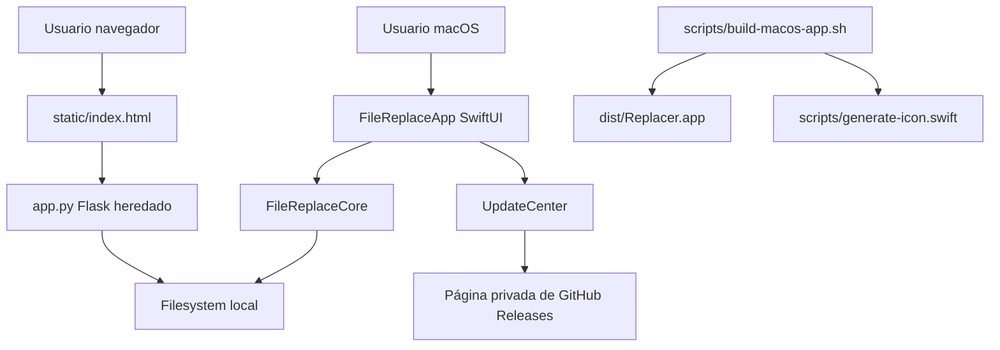

<!-- generated-by: gsd-doc-writer -->
# Arquitectura

## Visión General

Replacer es una utilidad local de escritorio para buscar una cadena exacta en archivos de texto y reemplazarla tras revisión del usuario. La arquitectura actual separa la lógica de filesystem en un módulo Swift testeable (`FileReplaceCore`) y la experiencia macOS en una app SwiftUI (`FileReplaceApp`). La versión Flask (`app.py` y `static/index.html`) se mantiene como legado compatible, pero no es la interfaz principal.

## Diagrama De Componentes



## Flujo De Datos

1. El usuario selecciona un directorio desde la UI nativa y, opcionalmente, un filtro de nombre (patrón glob tipo `*.js`, `config*`).
2. Al buscar, `FileReplaceService.search` valida directorio y cadena de búsqueda. El filtro de nombre es opcional; vacío significa "todos los archivos del alcance".
3. El core recorre el directorio (o el árbol hasta `maxDepth` niveles si la búsqueda es recursiva), aplica el filtro de nombre y, por cada archivo, lo lee como UTF-8 estricto.
4. Los archivos con bytes nulos, no decodificables como UTF-8 o que superan el tamaño máximo (`defaultMaxFileSizeBytes`, 5 MB) se añaden a `skippedFiles` y la búsqueda continúa con el resto.
5. La UI muestra coincidencias, conteo, vista previa, archivos omitidos y si se alcanzó el límite de resultados (`defaultMaxResults`, 1000).
6. Tras la búsqueda, ningún resultado queda preseleccionado: el usuario debe marcar explícitamente los archivos antes de poder reemplazar.
7. Sobre cada resultado, el usuario puede revelarlo en Finder o abrir una vista de solo lectura con su contenido íntegro y las coincidencias resaltadas; ninguna de las dos acciones modifica el filesystem ni afecta a la selección de reemplazo.
8. Al reemplazar, el core comprueba que el archivo sea escribible; si es de solo lectura devuelve `notWritable` sin crear backup ni tocar el archivo.
9. Si el archivo es escribible, el core crea primero una copia `.replacer-backup` junto al original y después escribe el nuevo contenido en UTF-8.

En distribución limitada no se incorporan tokens ni se consulta automáticamente la API privada de GitHub. `UpdateCenter` abre bajo petición la página de releases en el navegador, donde GitHub aplica la sesión y los permisos del destinatario. La acción está disponible en la cabecera y en el menú de la aplicación.

La versión Flask sigue un flujo equivalente para `/api/search` y `/api/replace`, con autorización de reemplazo basada en los resultados encontrados en la sesión del proceso.

## Abstracciones Clave

| Abstracción | Archivo | Responsabilidad |
|---|---|---|
| `FileReplaceService` | `Sources/FileReplaceCore/FileReplaceService.swift` | Orquesta búsqueda, lectura segura, conteo, backup y reemplazo. |
| `SearchHit` | `Sources/FileReplaceCore/FileReplaceService.swift` | Representa un archivo con coincidencias, su ruta relativa, conteo y preview. |
| `SearchReport` | `Sources/FileReplaceCore/FileReplaceService.swift` | Resume archivos revisados, hits y archivos sin coincidencias. |
| `ReplacementResult` | `Sources/FileReplaceCore/FileReplaceService.swift` | Devuelve número de reemplazos y ruta del backup creado. |
| `FileReplaceService.readFullContent` | `Sources/FileReplaceCore/FileReplaceService.swift` | Lee el contenido íntegro de un archivo para previsualizarlo, con las mismas validaciones UTF-8/tamaño que `search`. |
| `FileReplaceViewModel` | `Sources/FileReplaceApp/ContentView.swift` | Estado y acciones de la UI SwiftUI, incluida la previsualización de contenido y la localización en Finder. |
| `FileContentPreviewView` / `ReadOnlyHighlightedTextView` | `Sources/FileReplaceApp/ContentView.swift` | Hoja de solo lectura que muestra el contenido completo de un resultado con las coincidencias resaltadas. |
| `AppVersion` | `Sources/FileReplaceCore/AppVersion.swift` | Analiza y compara versiones estables y prereleases. |
| `UpdateCenter` | `Sources/FileReplaceApp/UpdateCenter.swift` | Abre la página privada de releases sin almacenar credenciales. |
| `read_text_file` | `app.py` | Lectura estricta UTF-8 de la versión Flask heredada. |
| `replace_in_file` | `app.py` | Reemplazo heredado con backup previo. |

## Organización De Directorios

```text
Package.swift
Sources/
  FileReplaceCore/      # Lógica reutilizable y testeable de búsqueda/reemplazo
  FileReplaceApp/       # App macOS SwiftUI, acceso a releases y recursos
Tests/
  FileReplaceCoreTests/ # Tests de comportamiento del core con fixtures temporales
scripts/
  build-macos-app.sh    # Empaquetado manual de dist/Replacer.app
  generate-icon.swift   # Generación de iconos .png/.icns
docs/                   # Documentación técnica y funcional
app.py                  # Servidor Flask heredado
static/index.html       # UI web heredada
```

## Límites Intencionados

- La búsqueda es por cadena exacta, no por expresiones regulares. El filtro de nombre admite patrones glob POSIX (`fnmatch`), no regex.
- El core solo procesa texto UTF-8 editable y omite archivos por encima del tamaño máximo; no rastrea binarios ni archivos enormes.
- Los backups se crean junto al archivo original; no hay sistema global de historial ni restauración automática.
- La app escribe en el filesystem local, por lo que el flujo exige selección explícita de resultados y confirmación antes de reemplazar.
- Los archivos de solo lectura se informan como error por archivo y no se modifican; la app no altera permisos.
- La búsqueda recursiva incluye archivos ocultos pero poda directorios de ruido (`.git`, `node_modules`, `.venv`, `.build`, `__pycache__`, etc.) y nunca trata los `.replacer-backup` como objetivo.
