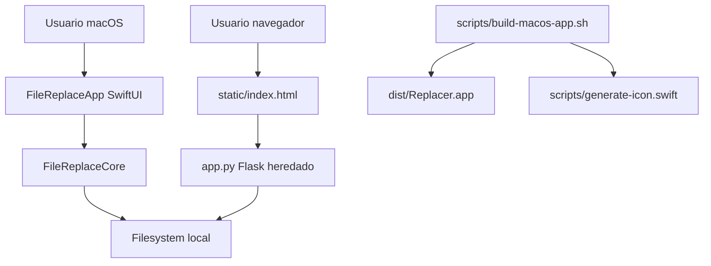

<!-- generated-by: gsd-doc-writer -->
# Arquitectura

## Visión General

Replacer es una utilidad local de escritorio para buscar una cadena exacta en archivos de texto y reemplazarla tras revisión del usuario. La arquitectura actual separa la lógica de filesystem en un módulo Swift testeable (`FileReplaceCore`) y la experiencia macOS en una app SwiftUI (`FileReplaceApp`). La versión Flask (`app.py` y `static/index.html`) se mantiene como legado compatible, pero no es la interfaz principal.

## Diagrama De Componentes



## Flujo De Datos

1. El usuario selecciona un directorio desde la UI nativa.
2. `ContentView.swift` lista nombres de archivos candidatos y limita el listado recursivo para mantener la app ágil.
3. Al buscar, `FileReplaceService.search` valida directorio, nombre de archivo y cadena de búsqueda.
4. El core localiza archivos con el nombre indicado, lee cada archivo como UTF-8 estricto y rechaza contenido con bytes nulos o no decodificable.
5. La UI muestra coincidencias, conteo y vista previa.
6. Al reemplazar, el core crea primero una copia `.replacer-backup` junto al archivo original.
7. Si el backup se crea correctamente, el core escribe el nuevo contenido con codificación UTF-8.

La versión Flask sigue un flujo equivalente para `/api/search` y `/api/replace`, con autorización de reemplazo basada en los resultados encontrados en la sesión del proceso.

## Abstracciones Clave

| Abstracción | Archivo | Responsabilidad |
|---|---|---|
| `FileReplaceService` | `Sources/FileReplaceCore/FileReplaceService.swift` | Orquesta búsqueda, lectura segura, conteo, backup y reemplazo. |
| `SearchHit` | `Sources/FileReplaceCore/FileReplaceService.swift` | Representa un archivo con coincidencias, su ruta relativa, conteo y preview. |
| `SearchReport` | `Sources/FileReplaceCore/FileReplaceService.swift` | Resume archivos revisados, hits y archivos sin coincidencias. |
| `ReplacementResult` | `Sources/FileReplaceCore/FileReplaceService.swift` | Devuelve número de reemplazos y ruta del backup creado. |
| `FileReplaceViewModel` | `Sources/FileReplaceApp/ContentView.swift` | Estado y acciones de la UI SwiftUI. |
| `read_text_file` | `app.py` | Lectura estricta UTF-8 de la versión Flask heredada. |
| `replace_in_file` | `app.py` | Reemplazo heredado con backup previo. |

## Organización De Directorios

```text
Package.swift
Sources/
  FileReplaceCore/      # Lógica reutilizable y testeable de búsqueda/reemplazo
  FileReplaceApp/       # App macOS SwiftUI y recursos empaquetados
Tests/
  FileReplaceCoreTests/ # Tests de comportamiento del core con fixtures temporales
scripts/
  build-macos-app.sh    # Empaquetado manual de dist/Replacer.app
  generate-icon.swift   # Generación de iconos .png/.icns
docs/                   # Documentación técnica y funcional
app.py                  # Servidor Flask heredado
static/index.html       # UI web heredada
```

## Límites Intencionados

- La búsqueda es por nombre exacto de archivo y cadena exacta, no por expresiones regulares.
- El core solo procesa texto UTF-8 editable.
- Los backups se crean junto al archivo original; no hay sistema global de historial ni restauración automática.
- La app escribe en el filesystem local, por lo que el flujo mantiene confirmación explícita antes de reemplazar.
